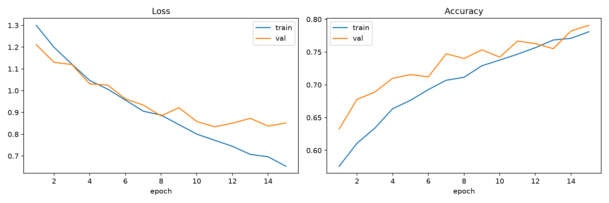
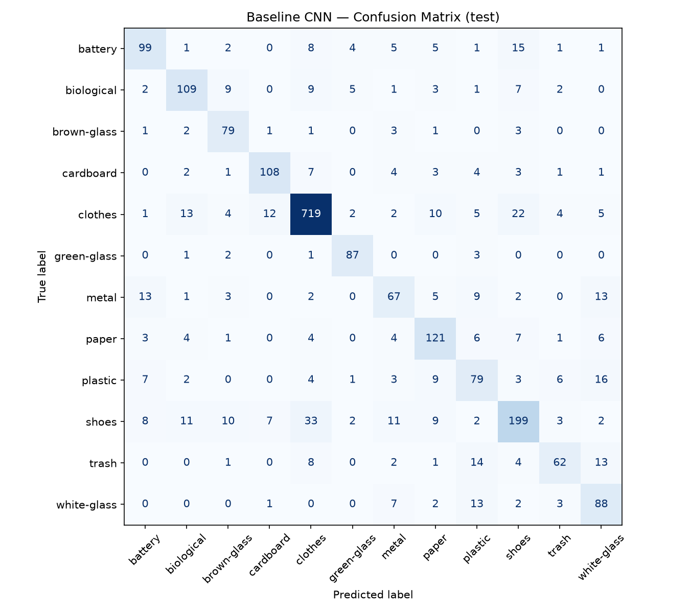
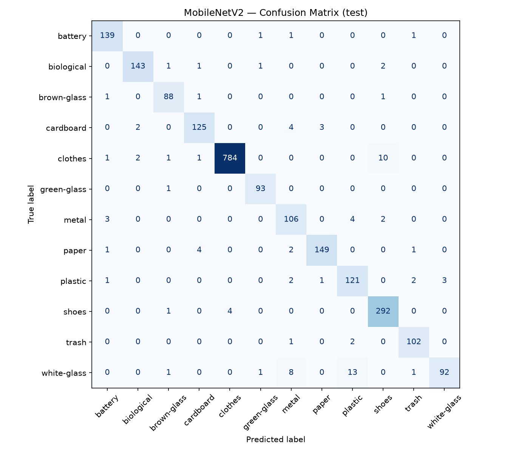

# ♻️ RecycleVision — Garbage Image Classification Using Deep Learning

[](https://recyclevision-garbage-image-classification-using-deep-learning.streamlit.app/)

**🚀 Live app:** https://recyclevision-garbage-image-classification-using-deep-learning.streamlit.app/

A deep learning project that classifies photos of waste into **12 categories** so recycling can be sorted automatically. The project compares a CNN built from scratch with two transfer-learning models (**MobileNetV2** and **ResNet50**) in PyTorch, then serves the best one (**ResNet50, 97.4% test accuracy**) through a **Streamlit** web app.

---

## Table of Contents

1. [Problem Statement](#problem-statement)
2. [Business Use Cases](#business-use-cases)
3. [Results at a Glance](#results-at-a-glance)
4. [Dataset](#dataset)
5. [Project Structure](#project-structure)
6. [Pipeline Overview](#pipeline-overview)
7. [Data Preprocessing & Augmentation](#data-preprocessing--augmentation)
8. [Exploratory Data Analysis](#exploratory-data-analysis)
9. [Models](#models)
10. [Training Strategy](#training-strategy)
11. [Evaluation](#evaluation)
12. [Streamlit App](#streamlit-app)
13. [Getting Started](#getting-started)
14. [Reproducing the Experiments](#reproducing-the-experiments)
15. [Real-World Test Images](#real-world-test-images)
16. [Limitations & Future Work](#limitations--future-work)
17. [Tech Stack](#tech-stack)

---

## Problem Statement

Build a deep learning model that classifies images of waste into categories such as plastic, metal, glass, paper, and organic matter. The system should help automate recycling by sorting garbage from an image, and the model should be available through a simple user interface.

## Business Use Cases

| Use case | How RecycleVision helps |
|---|---|
| **Smart recycling bins** | Identify an item from a camera image and send it to the right bin automatically. |
| **Municipal waste management** | Cut down the time and labour spent on manual sorting at recycling facilities. |
| **Educational tools** | Teach people to separate waste correctly with instant visual feedback. |
| **Environmental analytics** | Track waste composition and recycling trends over time. |

---

## Results at a Glance

All three models were evaluated on the **same held-out test set of 2,328 images**:

| Model | Test accuracy | Macro F1 | Weighted F1 | Parameters | Weights on disk |
|---|---:|---:|---:|---:|---:|
| Baseline CNN (from scratch) | 78.05% | 0.7354 | 0.7801 | ~0.62 M | 2.5 MB |
| MobileNetV2 (fine-tuned) | 95.96% | 0.9453 | 0.9595 | ~2.2 M | 9.2 MB |
| **ResNet50 (fine-tuned)** ✅ | **97.38%** | **0.9683** | **0.9738** | ~23.5 M | 94 MB |

**ResNet50 was selected** for deployment because it scored highest on macro F1. Macro F1 was the selection metric because it weights every class equally, which matters with an imbalanced dataset. MobileNetV2 comes within about 1.4 points of ResNet50 at roughly a tenth of the size, so it is the better option for edge or mobile deployment.

Source: [reports/metrics/model_comparison.json](reports/metrics/model_comparison.json)

---

## Dataset

**Garbage Classification (12 classes)**: the Kaggle dataset by Mostafa Mohamed ([link](https://www.kaggle.com/datasets/mostafaabla/garbage-classification)).

- **15,515 RGB images** across **12 classes**
- Images vary in size (in a random sample of 200: width 183–711 px, height 151–711 px, 62 distinct sizes), so everything is resized to 224×224.
- The dataset is **heavily imbalanced**: `clothes` has about 8.8× as many images as `brown-glass`.

| Class | Images | Class | Images |
|---|---:|---|---:|
| clothes | 5,325 | plastic | 865 |
| shoes | 1,977 | white-glass | 775 |
| paper | 1,050 | metal | 769 |
| biological | 985 | trash | 697 |
| battery | 945 | green-glass | 629 |
| cardboard | 891 | brown-glass | 607 |

Expected location on disk (one sub-folder per class, which is the layout `torchvision.datasets.ImageFolder` expects):

```
dataset/garbage_classification/
├── battery/
├── biological/
├── brown-glass/
├── ...
└── white-glass/
```

---

## Project Structure

```
.
├── 01_eda.ipynb                      # Exploratory data analysis
├── 02_baseline_cnn.ipynb             # Custom CNN trained from scratch
├── 03_transfer_learning.ipynb        # MobileNetV2 + ResNet50 (freeze → fine-tune)
├── 04_evaluation.ipynb               # Test-set metrics, confusion matrices, model comparison
├── app.py                            # Streamlit inference app (ResNet50)
├── download_real_world_dataset.py    # Scrapes extra "in the wild" test images from Bing
├── requirements.txt                  # Runtime dependencies for the app
│
├── helper_functions/
│   └── data_loading/
│       └── data_utils.py             # Shared data pipeline: get_dataloaders()
│
├── models/
│   ├── baseline.py                   # BaselineCNN class definition
│   ├── baseline_cnn.pt               # Trained baseline weights
│   ├── mobilenet_phase1.pt           # MobileNetV2 after head-only training
│   ├── mobilenet_v2.pt               # MobileNetV2 after full fine-tuning
│   ├── resnet50_phase1.pt            # ResNet50 after head-only training
│   └── resnet50.pt                   # ResNet50 after full fine-tuning (deployed)
│
├── reports/
│   ├── figures/                      # Training curves and confusion matrices
│   └── metrics/                      # Training histories (JSON) and final comparison
│
├── real_world_test/                  # 120 web-scraped images (10 per class)
├── sample_images/                    # Copy of real_world_test/, offered as samples in the app
└── dataset/garbage_classification/   # Kaggle dataset (12 class folders)
```

---

## Pipeline Overview

```
 Raw images ──► Stratified split (70/15/15, seed 42)
                      │
                      ├── Train  ─► Resize 224 + augmentation + ImageNet normalization
                      └── Val / Test ─► Resize 224 + ImageNet normalization
                                   │
            ┌──────────────────────┼───────────────────────┐
            ▼                      ▼                       ▼
     Baseline CNN            MobileNetV2               ResNet50
     (from scratch)     (freeze → fine-tune)     (freeze → fine-tune)
            └──────────────────────┼───────────────────────┘
                                   ▼
                  Test-set evaluation (accuracy, F1, confusion matrix)
                                   ▼
                 Best model (ResNet50) ──► Streamlit app
```

---

## Data Preprocessing & Augmentation

All notebooks load data through a single function, `get_dataloaders()` in [helper_functions/data_loading/data_utils.py](helper_functions/data_loading/data_utils.py), so **every model trains and is tested on exactly the same split**.

**Splitting**
- **Stratified** 70% / 15% / 15% train / validation / test split with `random_state=42`. The test set is carved out first, then validation is taken from what remains.
- Resulting sizes: about **10,859 train**, **2,328 validation** and **2,328 test** images (340 / 73 / 73 batches of 32).

**Transforms**

| Step | Train | Val / Test |
|---|:---:|:---:|
| Resize to 224×224 | ✅ | ✅ |
| Random horizontal flip | ✅ | — |
| Random rotation (±15°) | ✅ | — |
| Colour jitter (brightness ±0.2, contrast ±0.2) | ✅ | — |
| Convert to tensor | ✅ | ✅ |
| Normalize with ImageNet mean/std | ✅ | ✅ |

The code builds two `ImageFolder` views of the same directory, one augmented and one clean. That way validation and test images are never augmented.

**Handling class imbalance**
Class weights are computed with `sklearn.utils.class_weight.compute_class_weight("balanced")` from the **training labels only**, and passed to `nn.CrossEntropyLoss(weight=...)`. Rare classes such as `brown-glass` get a weight of about 2.13, while `clothes` gets about 0.24.

---

## Exploratory Data Analysis

[01_eda.ipynb](01_eda.ipynb) covers:

- **Class distribution**: a bar chart of images per class, which shows the imbalance.
- **Sample grid**: one example image from each of the 12 classes.
- **Image size analysis**: min, max and mean width and height over a random sample, which confirmed that resizing is needed.
- **Pipeline sanity check**: loads the dataloaders and prints the class names, batch counts and computed class weights.

---

## Models

### 1. Baseline CNN (from scratch)
Defined in [models/baseline.py](models/baseline.py). It is a small three-block convolutional network that serves as a reference point:

```
Conv(3→32, 3×3) → ReLU → MaxPool      224 → 112
Conv(32→64, 3×3) → ReLU → MaxPool     112 → 56
Conv(64→128, 3×3) → ReLU → MaxPool     56 → 28
AdaptiveAvgPool → 128×4×4
Flatten → Linear(2048→256) → ReLU → Dropout(0.3) → Linear(256→12)
```

### 2. MobileNetV2 (transfer learning)
- Pretrained on ImageNet (`MobileNet_V2_Weights.IMAGENET1K_V1`).
- The final classifier layer is replaced with `Linear(1280 → 12)`.

### 3. ResNet50 (transfer learning), the deployed model
- Pretrained on ImageNet (`ResNet50_Weights.IMAGENET1K_V2`).
- The fully connected head is replaced with `Linear(2048 → 12)`.

---

## Training Strategy

**Shared setup**
- Optimizer: Adam
- Loss: class-weighted cross-entropy
- Batch size: 32
- Device: Apple Silicon GPU (`mps`), falling back to CPU
- **Best-checkpoint selection**: after each epoch the weights with the highest validation accuracy are kept, and the final model uses those weights rather than the last epoch's.

**Baseline CNN**: trained for 2 + 15 epochs at `lr=1e-3`.

**Transfer models: two-phase training**

| Phase | What is trained | Learning rate | Epochs |
|---|---|---|---|
| **1. Feature extraction** | New classification head only; the pretrained backbone is frozen | 1e-3 | 10 |
| **2. Fine-tuning** | Entire network unfrozen | 1e-4 (10× lower) | 5 |

Phase 1 trains the randomly initialised head without disturbing the pretrained features. In phase 2, the low learning rate lets the whole network adapt to garbage images without overwriting what it learned from ImageNet.

**Best validation accuracy by stage**

| Model | After phase 1 | After phase 2 |
|---|---:|---:|
| Baseline CNN | 79.1% (single phase) | — |
| MobileNetV2 | 93.0% | 95.7% |
| ResNet50 | 95.7% | **97.5%** |

Full epoch-by-epoch histories are saved in [reports/metrics/](reports/metrics/).



---

## Evaluation

[04_evaluation.ipynb](04_evaluation.ipynb) reloads all three saved models and scores them on the untouched test set. It reports accuracy, macro F1 and weighted F1, plus a confusion matrix for each model and a per-class report.

### ResNet50: per-class results (test set)

| Class | Precision | Recall | F1 | Support |
|---|---:|---:|---:|---:|
| battery | 0.947 | 1.000 | 0.973 | 142 |
| biological | 0.993 | 0.986 | 0.990 | 148 |
| brown-glass | 0.978 | 0.989 | 0.984 | 91 |
| cardboard | 0.971 | 0.985 | 0.978 | 134 |
| clothes | 0.996 | 0.980 | 0.988 | 799 |
| green-glass | 1.000 | 1.000 | 1.000 | 94 |
| metal | 0.932 | 0.957 | 0.944 | 115 |
| paper | 0.987 | 0.975 | 0.981 | 157 |
| plastic | 0.914 | 0.900 | 0.907 | 130 |
| shoes | 0.954 | 0.983 | 0.968 | 297 |
| trash | 1.000 | 0.971 | 0.986 | 105 |
| white-glass | 0.930 | 0.914 | 0.922 | 116 |
| **Macro avg** | **0.967** | **0.970** | **0.968** | 2,328 |

**Observations**
- `green-glass` is classified perfectly. `biological`, `clothes` and `trash` are all close to perfect.
- The hardest classes are **plastic** (F1 0.907), **white-glass** (0.922) and **metal** (0.944). These materials are often transparent or reflective and look alike: clear plastic bottles resemble white glass, and shiny cans resemble foil-wrapped plastic.
- Class weighting worked: the minority classes reach F1 scores comparable to the majority class `clothes`.

### Confusion matrices

| Baseline CNN | MobileNetV2 | ResNet50 |
|---|---|---|
|  |  |  |

---

## Streamlit App

[app.py](app.py) is a lightweight web interface around the fine-tuned ResNet50. You can try it live at the [hosted app](https://recyclevision-garbage-image-classification-using-deep-learning.streamlit.app/).

**How it works**

1. **Choose an input mode** with the radio button:
   - **Upload an image**: upload your own `.jpg`, `.jpeg` or `.png` file.
   - **Use a sample image**: pick one of the 120 bundled images in [sample_images/](sample_images/) (10 per class, organised as `<class>/<file>.jpg`) from a dropdown. You don't need an image of your own to try the model.
2. The image is resized to 224×224 and normalized with ImageNet statistics, the same preprocessing used at evaluation time.
3. The app shows:
   - the selected image
   - the **predicted class** and its **confidence**
   - a **ranked probability bar** for all 12 classes

The page header also has a **🔗 Link to GitHub repository** button that opens this repo.

**Implementation notes**
- The model is loaded once and cached with `@st.cache_resource`, and inference runs on the CPU, so no GPU is needed.
- The sample dropdown lists every `.jpg`, `.jpeg` and `.png` under `sample_images/` recursively. To change the samples, add or remove files and redeploy. If the folder is empty, the app shows a warning instead of failing.
- Both input modes go through the same `show_results()` function, so predictions are displayed the same way.

---

## Getting Started

### Prerequisites
- Python 3.10+ (developed on 3.11)
- About 1 GB of free disk space for the dataset and model weights

### 1. Clone the repository
```bash
git clone https://github.com/mukundnaramesh2605/RecycleVision--Garbage-Image-Classification-Using-Deep-Learning.git
cd RecycleVision--Garbage-Image-Classification-Using-Deep-Learning
```

### 2. Create a virtual environment
```bash
python -m venv .venv
source .venv/bin/activate        # Windows: .venv\Scripts\activate
```

### 3. Install dependencies

**To run the app only:**
```bash
pip install -r requirements.txt
```
`requirements.txt` installs the **CPU** build of PyTorch, which keeps the install small for the app and for Streamlit Cloud.

**To run the notebooks too** (training, evaluation and EDA need a few more packages):
```bash
pip install torch torchvision scikit-learn matplotlib pandas numpy pillow jupyter
```
On Apple Silicon, the standard PyTorch wheel includes `mps` GPU support, which the notebooks use automatically.

### 4. Run the app
```bash
streamlit run app.py
```
Then open http://localhost:8501 and either upload an image or pick one from the bundled samples. Start the app from the project root, because `models/resnet50.pt` and `sample_images/` are loaded with relative paths.

---

## Reproducing the Experiments

1. **Get the dataset.** Download it from [Kaggle](https://www.kaggle.com/datasets/mostafaabla/garbage-classification) and extract it so the class folders sit under `dataset/garbage_classification/`.
2. **Run the notebooks in order:**

   | Notebook | Output |
   |---|---|
   | `01_eda.ipynb` | Class distribution, sample grid, image-size statistics |
   | `02_baseline_cnn.ipynb` | `models/baseline_cnn.pt`, `reports/metrics/baseline_history.json`, `reports/figures/baseline_curves.png` |
   | `03_transfer_learning.ipynb` | `models/mobilenet_*.pt`, `models/resnet50*.pt`, and their training histories |
   | `04_evaluation.ipynb` | Confusion matrices in `reports/figures/`, `reports/metrics/model_comparison.json` |

   The first run of `03_transfer_learning.ipynb` downloads the ImageNet weights: about 14 MB for MobileNetV2 and about 98 MB for ResNet50.
3. **Run the notebooks from the project root**, because every path (for example `DATA_DIR = "dataset/garbage_classification"`) is relative to it.

The split is fixed with `seed=42`, so the train, validation and test partitions are the same on every run. Exact metrics can still vary slightly between hardware backends because GPU operations are not fully deterministic.

---

## Real-World Test Images

Kaggle images tend to be clean and well lit. To check how the model copes outside that setting, [download_real_world_dataset.py](download_real_world_dataset.py) scrapes **10 images per class from Bing** into `real_world_test/`, using descriptive search terms (for example *"rotten fruit vegetable"* for `biological` and *"metal can"* for `metal`).

```bash
pip install icrawler
python download_real_world_dataset.py
```

The same 120 images are copied into `sample_images/`, where the Streamlit app offers them in its **Use a sample image** mode for a quick qualitative check. The scraped images have not been manually verified, so a few may be mislabelled or irrelevant.

---

## Limitations & Future Work

- **Domain shift**: the training images mostly show a single object on a plain background. Real bins are cluttered, contain several objects and have poor lighting.
- **Confusable materials**: plastic, white glass and metal remain the weakest classes. More targeted data or higher-resolution inputs could help.
- **Single-label only**: each image gets one class. Mixed waste would need object detection, for example YOLO.

Ideas for future work:
- Add a quantitative evaluation on `real_world_test/`.
- Try EfficientNet or ConvNeXt backbones, and add learning-rate scheduling and early stopping.
- Add Grad-CAM visualisations to the app so users can see what the model looks at.
- Show a top-3 view in the app, plus a low-confidence "not sure" state.
- Export MobileNetV2 to ONNX or TorchScript for on-device inference in smart bins.

---

## Tech Stack

| Area | Tools |
|---|---|
| Language | Python 3.11 |
| Deep learning | PyTorch, torchvision (ResNet50, MobileNetV2) |
| Data & metrics | NumPy, pandas, scikit-learn |
| Visualisation | Matplotlib |
| App | Streamlit |
| Data collection | icrawler (Bing image search) |
| Hardware | Apple Silicon GPU (MPS) for training, CPU for inference |

---

## Acknowledgements

- Dataset: [Garbage Classification (12 classes)](https://www.kaggle.com/datasets/mostafaabla/garbage-classification) on Kaggle.
- Pretrained weights: [torchvision model zoo](https://pytorch.org/vision/stable/models.html).
